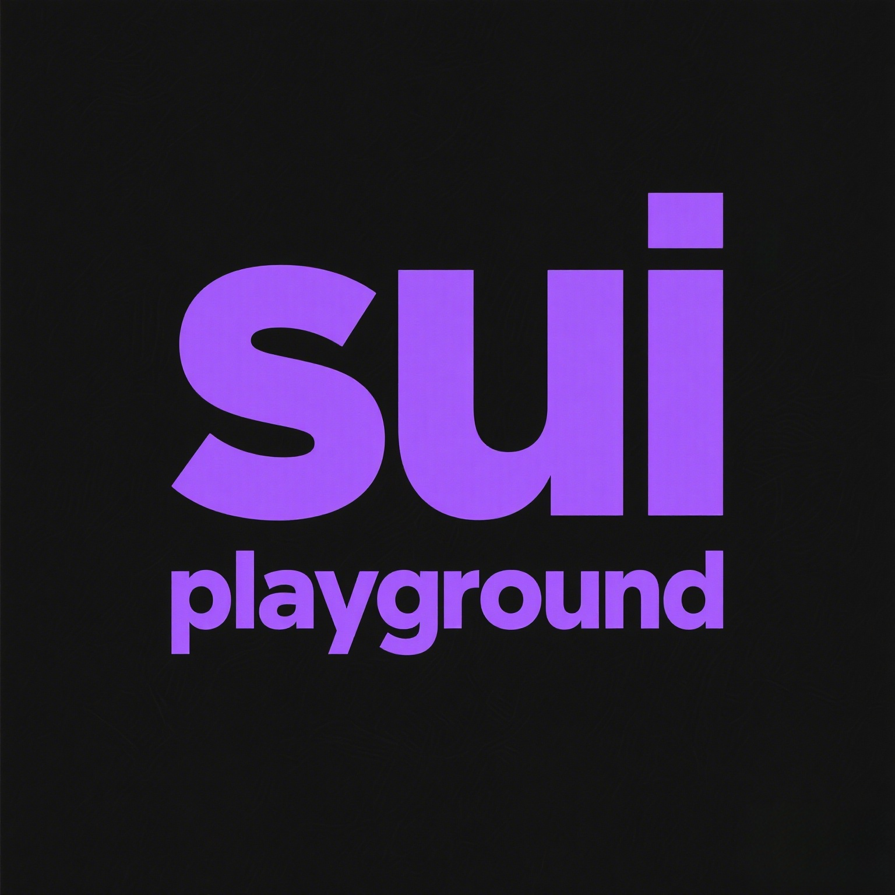
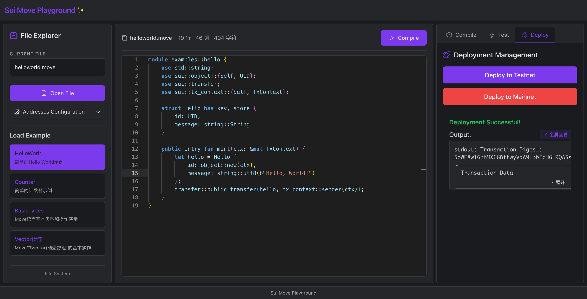

# Sui Move Playground ✨

[](LICENSE)
[](https://github.com/NormalSubgroup/sui-move-playground/actions)
<!-- [](https://github.com/NormalSubgroup/sui-move-playground/releases) -->
[](https://github.com/NormalSubgroup/sui-move-playground/stargazers)
<!-- [](https://discord.gg/sui-move-playground) -->
[](https://sui.io)

<div align="center">
  
  
  <p><em>A web-based development environment for Sui Move smart contracts</em></p>
  
  [🚀 Live Demo](https://sui.cauchy.top/) | [📖 Documentation](docs/) | [🐛 Report Bug](https://github.com/NormalSubgroup/sui-move-playground/issues) | [💡 Request Feature](https://github.com/NormalSubgroup/sui-move-playground/issues)
</div>

---

## 📖 About

Sui Move Playground is a comprehensive web-based development environment designed for Sui Move smart contracts. It provides an intuitive interface for code editing, compilation, testing, and deployment, making blockchain development accessible to developers of all skill levels.

### ✨ Key Features

- **🔰 Beginner-Friendly**: No need to run `sui move new`. Start coding right away with an intuitive interface
- **🖥️ GUI Support**: Simplified testing, deployment, and command execution through a graphical interface  
- **📋 Automatic Address Management**: Built-in tools for address validation and management, reducing the need for manual edits to `Move.toml`
- **⚡ Real-time Compilation**: Instant feedback on your Move code
- **🧪 Integrated Testing**: Run tests directly in the browser
- **🚀 One-Click Deployment**: Deploy your contracts with a single click

## 🎯 Demo

Try the live demo at: [sui.cauchy.top](https://sui.cauchy.top/)



## 🚀 Quick Start

### Prerequisites

Before you begin, ensure you have the following installed:

- **Rust**: Version `>= 1.75.0` - [Install Rust](https://www.rust-lang.org/tools/install)
- **Sui CLI**: Follow the instructions at [MystenLabs/sui](https://docs.sui.io/guides/developer/getting-started/sui-install)

### Local Development

1. **Clone the repository**
   ```bash
   git clone https://github.com/NormalSubgroup/sui-move-playground.git
   cd sui-move-playground
   ```

2. **First-time setup** (recommended)
   ```bash
   cd api
   cargo build
   cd ..
   ```

3. **Start the service**
   ```bash
   ./scripts/run.sh
   ```

4. **Access the playground**
   - Open your browser and navigate to `http://localhost:3000`

### Development Mode

For developers looking to contribute or customize:

1. **Start the API server**
   ```bash
   cargo run
   ```

2. **Start the web interface**
   ```bash
   bun install
   bun run dev
   ```

## 🏭 Production Deployment

### Quick Deployment

```bash
# Start service
sudo ./scripts/manage.sh start

# Check status
./scripts/manage.sh status

# Stop service
sudo ./scripts/manage.sh stop
```

### 🛠️ Management Tools

#### Complete Command List
```bash
./scripts/manage.sh help        # Show help information
./scripts/manage.sh status      # Check server status
./scripts/manage.sh test        # Run deployment tests
sudo ./scripts/manage.sh start  # Start server
sudo ./scripts/manage.sh stop   # Stop server
sudo ./scripts/manage.sh restart # Restart server
./scripts/manage.sh build       # Rebuild project
./scripts/manage.sh logs        # View server processes
./scripts/manage.sh journal     # View systemd logs
sudo ./scripts/manage.sh update # Update and redeploy
sudo ./scripts/manage.sh install   # Install as system service
sudo ./scripts/manage.sh uninstall # Uninstall system service
```

#### System Service Mode

Install as a system service for automatic startup:

```bash
# Install system service
sudo ./scripts/manage.sh install

# Manage with systemctl
systemctl status sui-move-playground
systemctl restart sui-move-playground
journalctl -f -u sui-move-playground
```

### 🌐 Access Information

- **Local Access**: http://localhost
- **External Access**: http://your-server-ip
- **Default Port**: 80 (HTTP)

## 📚 Documentation

- 🚀 **[Quick Deployment Guide](docs/DEPLOYMENT_SUMMARY.md)**
- 📘 **[Detailed Production Guide](docs/PRODUCTION_DEPLOYMENT.md)**
- 🔧 **[API Documentation](docs/api_documentation.md)** - 完整的后端API参考文档
- 📋 **[Final Deployment Status](docs/FINAL_DEPLOYMENT_STATUS.md)**
- 📁 **[Project Structure](docs/PROJECT_STRUCTURE.md)** - 项目目录结构说明
- 🎨 **[Frontend Guide](docs/frontend.md)**

## 🤝 Contributing

We welcome contributions from the community! Here's how you can help:

1. **Fork** the repository
2. **Create** a feature branch (`git checkout -b feature/amazing-feature`)
3. **Commit** your changes (`git commit -m 'Add some amazing feature'`)
4. **Push** to the branch (`git push origin feature/amazing-feature`)
5. **Open** a Pull Request

For major changes, please open a discussion first to ensure alignment with project goals.

### Development Guidelines

- Follow Rust coding standards for backend code
- Use TypeScript for frontend development
- Write tests for new features
- Update documentation as needed

## 📝 License

This project is licensed under the Apache License 2.0 - see the [LICENSE](LICENSE) file for details.

## 🙏 Acknowledgments

- 🏆 **[Sui Overflow 2025](https://sui.io/overflow)** - This project was created for the Sui Overflow hackathon
- [Sui Foundation](https://sui.io/) for the amazing blockchain platform
<!-- - [Move Language](https://move-language.github.io/) for the smart contract language -->
- All our [contributors](https://github.com/NormalSubgroup/sui-move-playground/contributors)

### 👥 Hackathon Team Members

- [@n-WN](https://github.com/n-WN) - Project Lead & Main Developer
- [@xwxb](https://github.com/xwxb) - Project Lead & Main Developer
- [@ChenXo0](https://github.com/ChenXo0) - Project Lead & Main Developer


## 📞 Support

- 📧 **Contact**: [n-WN](https://github.com/n-WN)
<!-- - 💬 **Discord**: [Join our community](https://discord.gg/sui-move-playground) -->
- 🐛 **Issues**: [GitHub Issues](https://github.com/NormalSubgroup/sui-move-playground/issues)

---

<div align="center">
  <strong>Happy coding with Sui Move Playground!</strong>
  
  ⭐ **Star us on GitHub** if you find this project helpful!
</div>